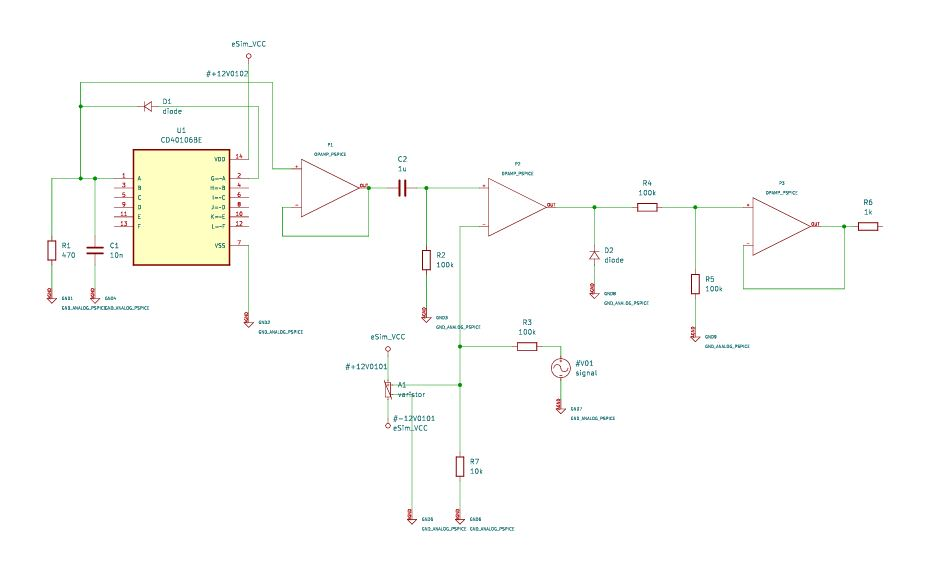

# PWM Generator using CD40106 and Operational Amplifiers

## Overview
This project presents the design and simulation of a Pulse Width Modulation (PWM) Generator using a Schmitt Trigger Oscillator (CD40106) and Operational Amplifiers.  
The system efficiently generates PWM signals with adjustable duty cycles, suitable for use in motor control, communication systems, and power regulation.

The design and validation were performed in **eSim** using the **IHP SG13G2 PDK**, ensuring compatibility with open-source EDA workflows.

---

## Abstract
Pulse Width Modulation (PWM) is a fundamental technique in electronics, enabling efficient control of power, signal modulation, and communication.  
This project implements a PWM generator circuit in which:

- The **CD40106 Schmitt Trigger** produces a stable sawtooth waveform.  
- The waveform is **buffered by an operational amplifier** for stability.  
- A **comparator stage** compares the sawtooth with a control voltage (CV input) to produce a PWM signal with an adjustable duty cycle.

The circuit was designed and simulated in **eSim** using **KiCAD and NGSpice**, demonstrating cost-effective and reliable PWM generation.

---

## Components Used
- CD40106 Schmitt Trigger IC  
- Operational Amplifiers (Op-Amps)  
- Resistors and Capacitors for timing and signal conditioning  
- Variable Control Voltage Source (CV)  
- eSim (Open-source EDA tool)   

---

## Circuit Design

### Schematic


The design consists of:
1. A **Schmitt Trigger Oscillator** using CD40106 to produce a sawtooth waveform.  
2. **Buffering op-amp** to stabilize the signal.  
3. **Comparator stage** that generates the PWM output by comparing the sawtooth waveform and the control voltage.

---
## Netlist

```spice
* ========================================
* Netlist generated from PWM Generator Schematic
* ========================================

* --- Oscillator Stage ---
* U1 is a CD40106BE Hex Schmitt-Trigger Inverter
* Only the first inverter (pins 1 & 2) is used for the oscillator.
* All other inputs (3, 5, 9, 11, 13) and unused outputs (4, 6, 8, 10, 12) are tied to ground.
U1  OSC_IN OSC_OUT 0 0 0 0 0 0 0 0 0 0 U1_VDD 0 CD40106BE
    * Pin 1:  OSC_IN (Input A)
    * Pin 2:  OSC_OUT (Output G)
    * Pin 3:  0 (Input B)
    * Pin 4:  0 (Output H)
    * Pin 5:  0 (Input C)
    * Pin 6:  0 (Output I)
    * Pin 7:  0 (VSS)
    * Pin 8:  0 (Output J)
    * Pin 9:  0 (Input D)
    * Pin 10: 0 (Output K)
    * Pin 11: 0 (Input E)
    * Pin 12: 0 (Output L)
    * Pin 13: 0 (Input F)
    * Pin 14: U1_VDD (VDD)

R1         OSC_IN OSC_OUT 470
C1         OSC_IN 0 10n
D1         +12V_B U1_VDD diode

* --- Buffer Stage (Voltage Follower) ---
X_P1       OSC_OUT BUF_OUT +12V_B 0 BUF_OUT OPAMP_PSPICE
    * IN+:    OSC_OUT
    * IN-:    BUF_OUT
    * VCC+:   +12V_B
    * VCC-:   0
    * OUT:    BUF_OUT

* --- Differentiator & Clipper Stage ---
C2         BUF_OUT DIFF_IN 1u
X_P2       0 DIFF_IN +12V_B 0 DIFF_OUT OPAMP_PSPICE
    * IN+:    0
    * IN-:    DIFF_IN
    * VCC+:   +12V_B
    * VCC-:   0
    * OUT:    DIFF_OUT
R2         DIFF_IN DIFF_OUT 100k
D2         0 DIFF_OUT diode

* --- Comparator Stage ---
V01        SIG_IN 0 signal
R3         SIG_IN COMP_P 100k
R4         DIFF_OUT COMP_N 100k
R5         COMP_N 0 100k
X_P3       COMP_P COMP_N +12V_B 0 COMP_OUT OPAMP_PSPICE
    * IN+:    COMP_P
    * IN-:    COMP_N
    * VCC+:   +12V_B
    * VCC-:   0
    * OUT:    COMP_OUT

* --- Output ---
R6         COMP_OUT OUT 1k

* --- Unconnected Power Circuit ---
A1         +12V_A -12V varistor
R7         -12V 0 10k

* --- Power Nets ---
* Note: The schematic shows two separate +12V nets.
* +12V_A = #+12V0101
* +12V_B = #+12V0102
* -12V   = #-12V0101
```
---

## Simulation Results
*(Add waveform plots or screenshots here once available.)*

**Expected Outputs:**
- Sawtooth waveform at the oscillator stage.  
- PWM waveform with a variable duty cycle depending on the CV input.

---

## Applications
- DC motor speed control  
- Signal modulation and demodulation  
- Power regulation circuits  
- Audio amplifiers and LED dimming systems  

---

## References
1. B. K. Bose, *Power Electronics and Motor Drives: Advances and Trends*, Academic Press, 2006.  
2. A. Sedra and K. Smith, *Microelectronic Circuits*, 7th Edition, Oxford University Press, 2015.  

---

## Tools and Environment
- Software: eSim (Open Source EDA)  
- PDK: IHP SG13G2  
- Design Type: Analog Circuit Design  

---

## Author
**Akanksha**  
Department of EECE  
Gandhi Institute of Technology and Management (GITAM)  
Email: [aakanksh@gitam.in](mailto:aakanksh@gitam.in)

